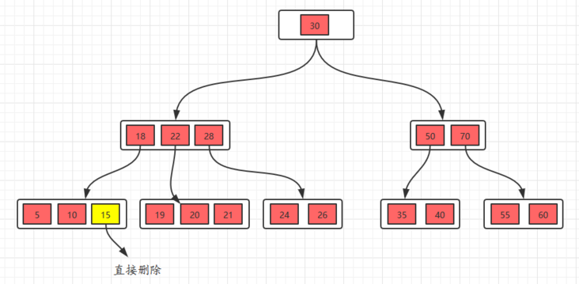

# 🥳 General

先放一个官方文档中的总架构图：

.png>)

每个 TiKV 实例的架构如下**图**所示：

* **Placement Driver：** PD 是 TiKV 的集群管理器，它定期检查复制约束以自动平衡负载和数据。
* **Store：**每个Store内部都有一个RocksDB，将数据存储到本地磁盘中。
* **Region：** Region是Key-Value数据移动的基本单位。每个Region被复制到多个节点。这些多个副本组成了一个 Raft 组。
* **Node：**集群中的一个物理节点。在每个节点内，有一个或多个 Store。在每个 Store 中，有许多 Region。

当一个节点启动时，Node、Store 和 Region 的元数据都会记录到 PD 中。每个 Region 和 Store 的状态都会定期上报给 PD。

#### 交易模式

TiKV 的事务模型类似于 Google 的[Percolator](https://ai.google/research/pubs/pub36726)，这是一个为处理大型数据集的更新而构建的系统。Percolator 使用增量更新模型代替基于批处理的模型。

TiKV 的交易模型提供：

* 带锁的**快照隔离（Snapshot isolation）**`SELECT ... FOR UPDATE`，语义类似于SQL
* 分布式事务中的外部一致性读写
