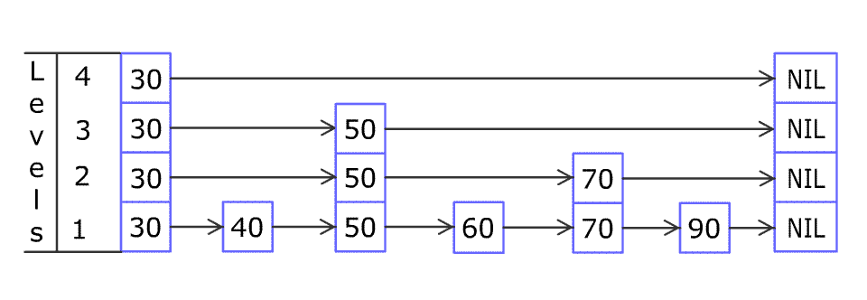

# Skip List

### Introduction

A skip list is a probabilistic data structure that supports fast lookup, insertion, and deletion. It can provide  lookup complexity and  insertion, deletion, and update complexity.

From the perspective of time complexity, it looks similar to a balanced tree. Compared with a balanced tree, however, its implementation is usually less complex and easier to reason about. Balanced trees often need rotations to maintain balance between the left and right subtrees. Those rotations increase coding complexity, make the data structure harder to understand, and make debugging less convenient. A skip list avoids many of these drawbacks: the idea is simple and the implementation is relatively direct.

Start with a linked list. Traversing a linked list takes ![\[formula\]](https://www.zhihu.com/equation?tex=O%28n%29). But we can add an extra pointer:

```cpp
struct node {
    int value_;
    int* next_;
    bool is_even_;
    int* second_next_;
}
```

If we add a pointer to roughly every other node and make it point two elements ahead, traversal can be about twice as fast. In the best case, the whole list can be traversed in ![\[formula\]](https://www.zhihu.com/equation?tex=O%28n%2F2%29).

 (1).png>)

By the same idea, if we keep adding more forward pointers to each node, we can aim for ![\[formula\]](https://www.zhihu.com/equation?tex=%5Clog+n) pointers and complete lookup in ![\[formula\]](https://www.zhihu.com/equation?tex=%5Clog+n) time. This is the core idea of a skip list.

For lookup to work, however, the elements must remain ordered. The premise is that insertions may arrive in arbitrary order.

A skip list introduces another key idea: random height. The number of forward pointers owned by a node is random.

 (2).png>)

For each node, its `i`-th pointer does not mean "point to the `i`-th following element." Instead, it points to the nearest following element whose pointer count is at least `i`, specifically to the corresponding `i`-th level.

### Node

First, consider the node.

Because we need one field for lookup and one field for the stored result, `key` and `value` are clearly required.

In addition, each node has a pointer list that records the positions it can point to.

Methods in the `Node` class:

* Assign the `k`-th forward pointer.
* Get the key of the node pointed to by the pointer at a specific depth.
* Get the node pointed to by the pointer at a specific depth.

### Skip! Skip! Skip!

It is usually better to write the constructor and the function that randomly generates node depth first. The random-depth function uses a probability `P`: generate a random floating-point value between 0 and 1; if it is greater than `P`, increase the depth, otherwise return the current depth. To avoid extreme cases where the depth grows without bound, define a maximum depth.

A skip list also has both `head` and `tail`. Because lookup requires ordered elements, set the key of `head` to negative infinity and the key of `tail` to positive infinity. By default, all forward pointers of `head` are populated and point to `tail`.

#### query

The lookup process is similar to a greedy strategy. At each step, look as far as possible on the current level. If the key seen from the current node is smaller than the search target, jump forward; otherwise, scan the current node's pointers from higher levels down to lower levels.


For example, in the figure above, suppose we want to find `20`. First, from the highest level at `head`, we look forward and immediately see positive infinity. Since it is greater than `20`, we have looked too far and should move down one level. After moving down to level 4, we see `17`, which is smaller than `20`, so we move to `17`.

After reaching `17`, we still start from level 4. We then find that every level sees an element greater than or equal to `20`. This means `17` is the closest preceding element to `20`, even if `20` may not exist. From `17`, we move forward by one step; that position is where `20` may appear. If that position is not `20`, then `20` does not exist in the skip list.

#### delete

First, find the node `X` to be deleted.

Deleting it directly is not enough. We also need to update the forward pointers of some nodes before `X`, specifically the pointers that currently point to `X`.

This connects naturally to the lookup procedure. Recall the greedy lookup strategy: at each level, we look as far as possible.

Every time the search moves down one level, the current element is the nearest element that can see `X` at that level. Therefore, we only need to record all positions where the search moves downward.

#### insert

Insertion also begins with lookup, because the new element must be placed at the correct sorted position.

If an element already exists at that position, we can directly modify its `value`; this is effectively an update operation. If the design forbids updates, the operation can return failure instead.

Insertion also affects the pointers of other elements. If we analyze the pointer changes, insertion is the reverse of deletion. During deletion, we need to redirect pointers that point to `X` so that they point to the node after `X`. During insertion, we do the opposite: pointers that previously pointed to the node after `X` should now point to `X`, and `X`'s own forward pointers must also be set correctly. If deletion is clear, insertion follows the same logic in reverse.

Here is an animation from Wikipedia:





<mark style="color:purple;">**Here is a**</mark> [<mark style="color:purple;background-color:blue;">**C++ example**</mark>](https://github.com/SleepyLGod/miscellaneous/tree/main/skiplist) <mark style="color:purple;background-color:blue;">****</mark> <mark style="color:purple;">**that I wrote.**</mark>


