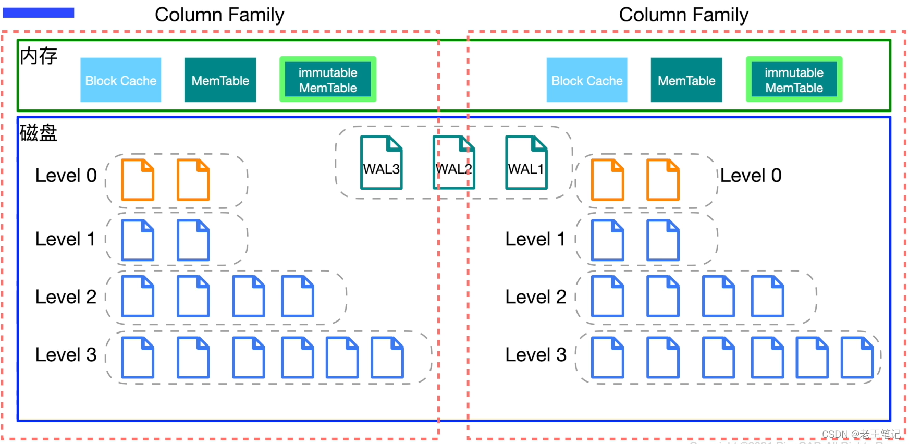

# 🥲 Smart Pointers

### Introduction

忘了加delete？不在合适的地方加入delete？那将是一场灾难！

自动释放内存，只有类可以做到😭

于是智能指针<mark style="color:purple;background-color:blue;">`auto_ptr`</mark>、<mark style="color:purple;background-color:blue;">`unique_ptr`</mark>和<mark style="color:purple;background-color:purple;">`shared_ptr`</mark>来了！

<mark style="color:purple;">**将基本类型指针封装为类对象指针（这个类肯定是个模板，以适应不同基本类型的需求），并在析构函数里编写delete语句删除指针指向的内存空间。**</mark>

再说说**引用计数**：

> 基本想法是对于动态分配的对象，进行引用计数，每当增加一次对同一个对象的引用，那么引用对象的引用计数就会增加一次， 每删除一次引用，引用计数就会减一，当一个对象的引用计数减为零时，就自动删除指向的堆内存。

STL一共给我们提供了四种智能指针包括 `std::shared_ptr`/`std::unique_ptr`/`std::weak_ptr`，使用它们需要包含头文件 `<memory>`.

模板`auto_ptr`是C++98提供的解决方案，C+11已将将其摒弃，并提供了另外3种解决方案。

所有的智能指针类都有一个**explicit构造函数**，**以指针作为参数**。比如`auto_ptr`的类模板原型为：

```cpp
templet<class T>
class auto_ptr {
  explicit auto_ptr(X* p = 0) ; 
  ...
}
```

因此不能自动将指针转换为智能指针对象，必须**显式调用**：

```cpp
shared_ptr<double> pd; 
double *p_reg = new double;
pd = p_reg;                               // not allowed (implicit conversion)
pd = shared_ptr<double>(p_reg);           // allowed (explicit conversion)
shared_ptr<double> pshared = p_reg;       // not allowed (implicit conversion)
shared_ptr<double> pshared(p_reg);        // allowed (explicit conversion
```

对全部三种智能指针都**应避免**的一点：

```cpp
string vacation("I wandered lonely as a cloud.");
shared_ptr<string> pvac(&vacation);   // No
```

全局变量在堆中，智能指针pvac过期时，程序将把delete运算符用于非堆内存，这是错误的。

### `std::shared_ptr`

它能够记录多少个 `shared_ptr` **共同指向一个对象**，从而消除显式的调用 `delete`，当引用计数变为零的时候就会将对象自动删除。

但还不够，因为使用 `std::shared_ptr` 仍然需要使用 `new` 来调用，这使得代码出现了某种程度上的不对称。

**`std::make_shared`** 就能够用来消除显式的使用 `new`，所以`std::make_shared` 会分配创建传入参数中的对象， 并返回这个对象类型的`std::shared_ptr`指针。例如：

```cpp
#include<iostream>
#include<memory>
void foo(std::shared_ptr<int> i) {
    (*i)++;
}
int main() {
    // auto pointer = new int(10); // illegal, no direct assignment
    // Constructed a std::shared_ptr
    auto pointer = std::make_shared<int>(10);
    foo(pointer);
    std::cout << *pointer << std::endl; // 11
    // The shared_ptr will be destructed before leaving the scope
    return 0;
}
```

`std::shared_ptr` 可以通过 **`get()`** 方法来获取原始指针，通过 **`reset()`** 来减少一个引用计数， 并通过**`use_count()`**来查看一个对象的引用计数。例如：

```cpp
auto pointer = std::make_shared<int>(10);
auto pointer2 = pointer; // 引用计数+1
auto pointer3 = pointer; // 引用计数+1
int *p = pointer.get();  // 这样不会增加引用计数
std::cout << "pointer.use_count() = " << pointer.use_count() << std::endl;   // 3
std::cout << "pointer2.use_count() = " << pointer2.use_count() << std::endl; // 3
std::cout << "pointer3.use_count() = " << pointer3.use_count() << std::endl; // 3

pointer2.reset();
std::cout << "reset pointer2:" << std::endl;
std::cout << "pointer.use_count() = " << pointer.use_count() << std::endl;   // 2
std::cout << "pointer2.use_count() = "
          << pointer2.use_count() << std::endl;           // pointer2 已 reset; 0
std::cout << "pointer3.use_count() = " << pointer3.use_count() << std::endl; // 2
pointer3.reset();
std::cout << "reset pointer3:" << std::endl;
std::cout << "pointer.use_count() = " << pointer.use_count() << std::endl;   // 1
std::cout << "pointer2.use_count() = " << pointer2.use_count() << std::endl; // 0
std::cout << "pointer3.use_count() = "
          << pointer3.use_count() << std::endl;           // pointer3 已 reset; 0

```

### **`std::unique_ptr`**

`std::unique_ptr` 是一种独占的智能指针，它禁止其他智能指针与其共享同一个对象，从而保证代码的安全：

```cpp
std::unique_ptr<int> pointer = std::make_unique<int>(10); // make_unique 从 C++14 引入
std::unique_ptr<int> pointer2 = pointer; // 非法
```

`make_unique` 并不复杂，C++11 没有提供 `std::make_unique`，可以自行实现：

```cpp
template<typename T, typename ...Args>
std::unique_ptr<T> make_unique( Args&& ...args ) {
  return std::unique_ptr<T>( new T( std::forward<Args>(args)... ) );
}
```

至于为什么没有提供，C++ 标准委员会主席 Herb Sutter 在他的[博客](https://herbsutter.com/gotw/\_102/)中提到原因是因为『被他们忘记了』，[**这里**](https://stackoverflow.com/questions/12580432/why-does-c11-have-make-shared-but-not-make-unique)笑一笑😂。

既然是独占，换句话说就是不可复制。但是，我们可以利用 `std::move` 将其转移给其他的 `unique_ptr`，例如：

```cpp
#include <iostream>
#include <memory>

struct Foo {
    Foo() { std::cout << "Foo::Foo" << std::endl; }
    ~Foo() { std::cout << "Foo::~Foo" << std::endl; }
    void foo() { std::cout << "Foo::foo" << std::endl; }
};

void f(const Foo &) {
    std::cout << "f(const Foo&)" << std::endl;
}

int main() {
    std::unique_ptr<Foo> p1(std::make_unique<Foo>());
    // p1 不空, 输出
    if (p1) {
        p1->foo();
    }
    {
        std::unique_ptr<Foo> p2(std::move(p1));
        // p2 不空, 输出
        f(*p2);
        // p2 不空, 输出
        if(p2) {p2->foo();}
        // p1 为空, 无输出
        if(p1) {p1->foo();}
        p1 = std::move(p2);
        // p2 为空, 无输出
        if(p2) {p2->foo();}
        std::cout << "p2 被销毁" << std::endl;
    }
    // p1 不空, 输出
    if (p1) {p1->foo();}
    // Foo 的实例会在离开作用域时被销毁
}
```

### **`std::weak_ptr`**

如果你仔细思考 `std::shared_ptr` 就会发现依然存在着资源无法释放的问题。看下面这个例子：

```cpp
struct A;
struct B;

struct A {
    std::shared_ptr<B> pointer;
    ~A() {
        std::cout << "A 被销毁" << std::endl;
    }
};
struct B {
    std::shared_ptr<A> pointer;
    ~B() {
        std::cout << "B 被销毁" << std::endl;
    }
};
int main() {
    auto a = std::make_shared<A>();
    auto b = std::make_shared<B>();
    a->pointer = b;
    b->pointer = a;
}
```

运行结果是 A, B 都不会被销毁，这是因为 a,b 内部的 pointer 同时又引用了 `a,b`，这使得 `a,b` 的引用计数均变为了 2，而离开作用域时，`a,b` 智能指针被析构，却只能造成这块区域的引用计数减一，这样就导致了 `a,b` 对象指向的内存区域引用计数不为零，而外部已经没有办法找到这块区域了，也就造成了内存泄露，如图&#x20;

.png>)

解决这个问题的办法就是使用弱引用指针 `std::weak_ptr`，`std::weak_ptr`是一种弱引用（相比较而言 `std::shared_ptr` 就是一种强引用）。弱引用不会引起引用计数增加，当换用弱引用时候，最终的释放流程如图&#x20;



在上图中，最后一步只剩下 B，而 B 并没有任何智能指针引用它，因此这块内存资源也会被释放。

`std::weak_ptr` 没有 `*` 运算符和 `->` 运算符，所以不能够对资源进行操作，它可以用于检查 `std::shared_ptr` 是否存在，其 `expired()` 方法能在资源未被释放时，会返回 `false`，否则返回 `true`；除此之外，它也可以用于获取指向原始对象的 `std::shared_ptr` 指针，其 `lock()` 方法在原始对象未被释放时，返回一个指向原始对象的 `std::shared_ptr` 指针，进而访问原始对象的资源，否则返回`nullptr`。

### **How to choose?**

如果程序要使用**多个指向同一个对象的指针**，应选择`shared_ptr`。这样的情况包括：

* 有一个指针数组，并使用一些辅助指针来标示特定的元素，如最大的元素和最小的元素；
* 两个对象包含都指向第三个对象的指针；
* STL容器包含指针。很多STL算法都支持复制和赋值操作，这些操作可用于`shared_ptr`，但不能用于`unique_ptr`（编译器发出warning）和`auto_ptr`（行为不确定）。如果你的编译器没有提供`shared_ptr`，可使用**Boost库**提供的`shared_ptr`。

如果程序不需要多个指向同一个对象的指针，则可使用`unique_ptr`。

如果函数使用`new`分配内存，并返还指向该内存的指针，将其返回类型声明为`unique_ptr`是不错的选择。这样，所有权转让给接受返回值的`unique_ptr`，而该智能指针将负责调用`delete`。可将`unique_ptr`存储到STL容器，**只要不调用将一个`unique_ptr`复制或赋给另一个**算法（`如sort()`）。例如，可在程序中使用类似于下面的代码段

```cpp
unique_ptr<int> make_int(int n) {
    return unique_ptr<int>(new int(n));
}
void show(unique_ptr<int> &p1) {
    cout << *a << ' ';
}
int main() {
    ...
    vector<unique_ptr<int> > vp(size);
    for(int i = 0; i < vp.size(); i++) {
        vp[i] = make_int(rand() % 1000); // copy temporary unique_ptr
    }
    vp.push_back(make_int(rand() % 1000)); // ok because arg is temporary
    for_each(vp.begin(), vp.end(), show); // use for_each()
    ...
}
```

其中`push_back`调用没有问题，因为它**返回一个临时`unique_ptr`**，该`unique_ptr`被赋给vp中的一个`unique_ptr`。另外，如果**按值而不是按引用**给`show()`传递对象，`for_each()`将非法，因为这将导致使用一个来自vp的非临时`unique_ptr`初始化p1，而这是不允许的。前面说过，编译器将发现错误使用`unique_ptr`的企图。

在`unique_ptr`为右值时，可将其赋给`shared_ptr`，这与将一个`unique_ptr`赋给一个需要满足的条件相同。与前面一样，在下面的代码中，`make_int()`的返回类型为`unique_ptr<int>`：

```cpp
unique_ptr<int> pup(make_int(rand() % 1000));   // ok
shared_ptr<int> spp(pup);                       // not allowed, pup as lvalue
shared_ptr<int> spr(make_int(rand() % 1000));   // ok
```

模板`shared_ptr`包含一个显式构造函数，可用于将右值`unique_ptr`转换为`shared_ptr`。`shared_ptr`将接管原来归`unique_ptr`所有的对象。

在满足`unique_ptr`要求的条件时，也可使用`auto_ptr`，但`unique_ptr`是更好的选择。如果你的编译器没有`unique_ptr`，可考虑使用**Boost库提供的`scoped_ptr`**，它与`unique_ptr`类似。
